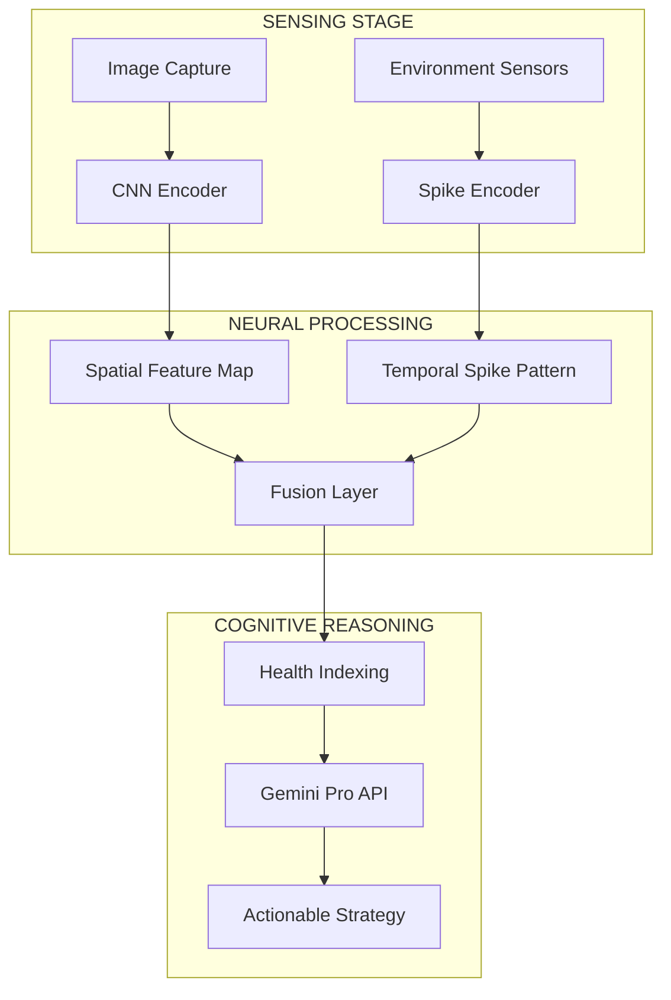

# 🌿 AgriGuard: Multimodal Neuromorphic Intelligence for Precision Agriculture

> **Bridging the gap between Plant Physiology and Computational Intelligence.**


---

## 👁️ The Vision: From Reactive to Proactive

In modern agriculture, **late detection** is a silent killer. AgriGuard is built on the philosophy of **early bio-feedback**. By treating environmental fluctuations as neural spikes and leaf textures as spatial matrices, the system detects stress at the pre-symptomatic stage.

---

## 🧠 The Mathematical Core: Why Neuromorphic?

AgriGuard uses **Spiking Neural Networks (SNNs)** with the **Leaky Integrate-and-Fire (LIF)** neuron model.

The membrane potential is governed by:

```math
\tau_m \frac{dU(t)}{dt} = -[U(t) - U_{rest}] + RI(t)
```

### Why this matters

1. **Sparsity:** Data is processed only when a spike occurs  
2. **Efficiency:** Lower power consumption on edge devices  
3. **Temporal Awareness:** Captures changing environmental conditions over time  

---

## 🏗️ Technical Architecture

### 1. Spatial Perception Module (CNN)
- Extracts high-dimensional features from leaf imagery
- Identifies biotic stress such as diseases, discoloration, and pest damage

### 2. Temporal Sensory Module (SNN)
- Encodes sensor data into spiking tensors
- Detects abiotic stress such as temperature imbalance, soil moisture deficiency, and humidity changes

### 3. Cognitive Advisory Layer (LLM)
- Uses Gemini Pro for cross-domain data fusion
- Generates actionable scientific recommendations for farmers

---

## 🔄 System Flow & Data Pipeline



---

## 🚀 Smart-Field Roadmap

### Phase 1: Nano-Edge Deployment
- Quantize models for NVIDIA Jetson and Raspberry Pi
- Enable offline-first inference for remote farm regions
- Reduce model size for low-power devices

### Phase 2: Multi-Spectral Swarm Integration
- Enable drone-based agricultural monitoring
- Integrate NDVI and multispectral data
- Improve SNN accuracy using aerial imagery

### Phase 3: Autonomous Agricultural Ecosystem
- Connect with automated irrigation systems
- Add predictive yield estimation
- Enable closed-loop precision farming

---

## 📂 Repository Structure

```text
AgriGuard/
├── 📄 app.py                           # Streamlit Dashboard (Main Entry)
├── 🧠 train_snn.py                     # Neuromorphic SNN Training Pipeline
├── 👁️ leaf_stress_model_final.h5       # Pre-trained CNN Weights
├── 🧬 snn_model.pth                    # Trained Spiking Neural Network Weights
├── 🛠️ clean_data.py                    # Data Cleaning & Feature Engineering
│
├── 📂 data/                            # Data Management Core
│   ├── 📂 environmental/               # Raw & Processed Sensor Logs (.csv)
│   └── 📂 images/                      # Leaf Dataset (Train/Test/Val)
│
├── 📂 src/                             # Core Processing Logic
│   └── 📂 preprocessing/               # Image Splitting & CSV Processing
│
├── 📂 models/                          # Model Artifacts Storage
├── 📄 requirements.txt                 # Project Dependencies
├── 📄 .env                             # Secure API Configuration (Gemini Pro)
└── 📄 README.md                        # Project Documentation
```

---

## ⚙️ Installation

```bash
git clone https://github.com/ankush033/AgriGuard-Neuromorphic-Stress-Detection.git
cd AgriGuard-Neuromorphic-Stress-Detection
pip install -r requirements.txt
```

---

## ▶️ Running the Project

```bash
python app.py
```

---

## 🛠️ Tech Stack

- Python
- TensorFlow / Keras
- CNN
- Spiking Neural Networks
- Gemini Pro API
- OpenCV
- NumPy
- Pandas
- Streamlit
- Flask

---

## 🎯 Key Features

- Early stress detection before visible symptoms
- CNN-based leaf disease classification
- SNN-based environmental anomaly detection
- Fusion of image and sensor data
- AI-generated advisory system using Gemini Pro
- Edge-device friendly design
- Ready for drone and multispectral integration

---

## ⚠️ Disclaimer

AgriGuard is a research-based diagnostic tool. Recommendations generated by the system should always be cross-verified with agricultural experts before making critical farming decisions.

---

## 👨‍💻 Developer

**Lead Architect:** Ankush  

Inspired by sustainable precision farming through bio-inspired computing.